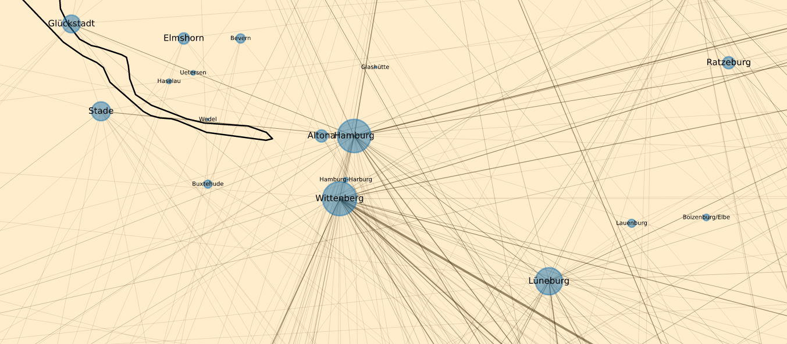
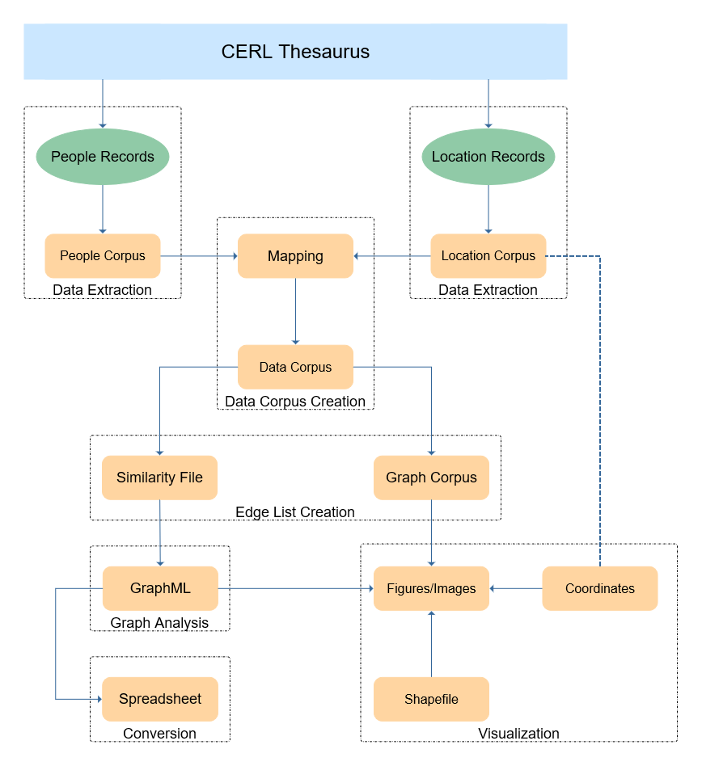

# CERL Thesaurus Networks

By running the scripts in the correct order, a graph with a metadata network based on places/cities from the [CERL Thesaurus](https://data.cerl.org/thesaurus/) can be constructed.

To run script ```9_map_vis.py```, download the shapefile archive from
https://gisco-services.ec.europa.eu/distribution/v2/nuts/download/ref-nuts-2021-20m.shp.zip
and extract it to ```./data/shapefiles/ref-nuts-2021-20m.shp```. Or use other shapefiles and adjust the script accordingly.



## Workflow
