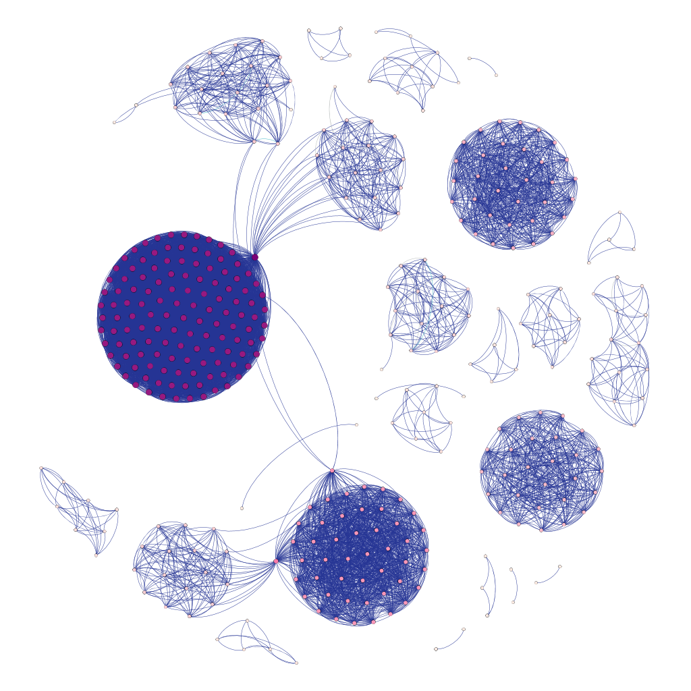

# Faust Metadata Networks

By running the scripts in the correct order, a graph with a metadata network based on Faust (Goethe) works from the [GVK](https://kxp.k10plus.de/DB=2.1/) (Gemeinsamer Verbundkatalog) can be constructed.

